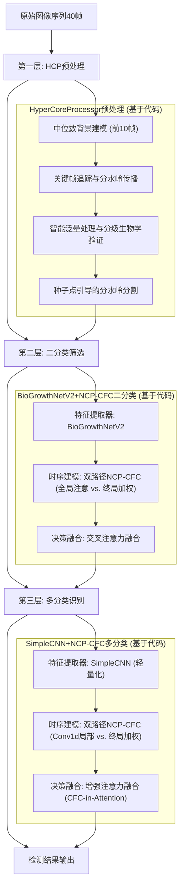
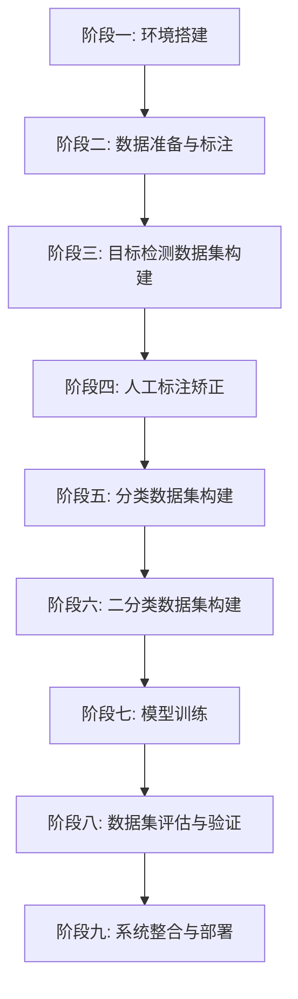
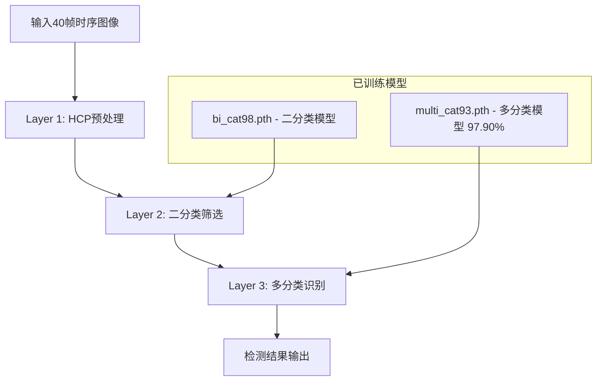
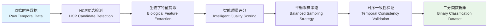

# Focust: 食源性致病菌时序自动化训练检测系统
# Focust: Foodborne Pathogen Temporal Automated Training Detection System

> **FOCUST** = **FO**odborne + **C**olony + **A**utomated + **S**ystem + **T**emporal  
> **食源性菌落自动化系统时序分析 | Foodborne Colony Automated System Temporal Analysis**

## 目录 | Table of Contents

1. [项目概述 | Project Overview](#项目概述--project-overview)
2. [系统架构 | System Architecture](#系统架构--system-architecture)
3. [使用教程 | Usage Tutorial](#使用教程--usage-tutorial)
   - [环境搭建 | Environment Setup](#阶段一环境搭建--stage-1-environment-setup)
   - [数据准备与标注 | Data Preparation & Annotation](#阶段二数据准备与标注--stage-2-data-preparation--annotation)
   - [目标检测数据集构建 | Object Detection Dataset Construction](#阶段三目标检测数据集构建--stage-3-object-detection-dataset-construction)
   - [人工标注矫正 | Manual Annotation Correction](#阶段四人工标注矫正--stage-4-manual-annotation-correction)
   - [分类数据集构建 | Classification Dataset Construction](#阶段五分类数据集构建--stage-4-classification-dataset-construction)
   - [二分类数据集构建 | Binary Classification Dataset Construction](#阶段六二分类数据集构建--stage-5-binary-classification-dataset-construction)
   - [模型训练 | Model Training](#阶段七模型训练--stage-6-model-training)
   - [数据集评估与验证 | Dataset Evaluation & Validation](#阶段八数据集评估与验证--stage-7-dataset-evaluation--validation)
   - [系统整合与部署 | System Integration & Deployment](#阶段九系统整合与部署--stage-8-system-integration--deployment)
   - [实时智能检测 | Real-time Intelligent Detection](#阶段十实时智能检测--stage-9-real-time-intelligent-detection)
4. [快速开始指南 | Quick Start Guide](#-快速开始指南--quick-start-guide)
5. [算法原理深度解析 | In-Depth Algorithm Analysis](#算法原理深度解析--in-depth-algorithm-analysis)
   - [菌落检测的三大核心挑战 | Three Core Challenges](#菌落检测的三大核心挑战)
   - [第一层：HCP算法的真实实现逻辑 | Layer 1: The Actual Implementation Logic of the HCP Algorithm](#第一层hcp算法的真实实现逻辑--layer-1-the-actual-implementation-logic-of-the-hcp-algorithm)
   - [第二层：二分类模型深度架构 | Layer 2: Binary Classification Model Deep Architecture](#第二层二分类模型深度架构--layer-2-binary-classification-model-deep-architecture)
   - [第三层：多分类模型深度架构 | Layer 3: Multi-Classification Model Deep Architecture](#第三层多分类模型深度架构--layer-3-multi-classification-model-deep-architecture)
   - [三层架构的协同智慧 | Synergy of the Three-Layer Architecture](#三层架构的协同智慧)
6. [项目文件结构 | Project Structure](#-项目文件结构--project-structure)
7. [数据格式说明 | Data Format Specification](#数据格式说明--data-format-specification)
8. [性能评估 | Performance Evaluation](#性能评估--performance-evaluation)
9. [配置说明 | Configuration Guide](#-配置说明--configuration-guide)
10. [技术支持 | Technical Support](#技术支持--technical-support)

<div align="center">


**食源性致病菌时序自动化训练检测系统**  
**Foodborne Pathogen Temporal Automated Training Detection System**

[](https://python.org)
[](https://pytorch.org)
[](LICENSE)

</div>

---

## 项目概述 | Project Overview

**中文概述 | Chinese Overview**  
Focust是一个基于深度学习与传统计算机视觉混合架构的智能菌落检测系统，专门用于食源性致病菌的自动化识别和分类。系统采用**HCP预处理+二分类+多分类三层检测架构**，支持40帧时序分析，能够有效区分真实菌落与食品残渣干扰。

**英文概述 | English Overview**  
Focust is an intelligent colony detection system based on hybrid deep learning and traditional computer vision architecture, specifically designed for automated identification and classification of foodborne pathogens. The system uses **HCP Preprocessing + Binary Classification + Multi-classification Three-Layer Detection Architecture** with 40-frame temporal analysis capabilities to effectively distinguish real colonies from food debris interference.

**核心价值 | Core Value**  
解决食品安全检测中菌落与残渣混淆的关键问题 | Solving the key problem of colony and debris confusion in food safety detection

---

## 系统架构 | System Architecture

### 三层检测架构 | Three-Layer Detection Architecture

系统采用三层递进式检测架构，每层承担不同的检测任务：



---

**第一层 HyperCoreProcessor (HCP)**:
*   **输入**: 40帧时序图像序列
*   **功能**: 传统计算机视觉算法快速筛选候选区域
*   **输出**: 高质量的候选菌落区域及其分割掩码
*   **技术 (基于代码实现)**: **中位数背景建模 + 关键帧追踪与分水岭传播 + 分级生物学验证**

---
*   **Layer 1: HyperCoreProcessor (HCP)**:
*   **Input**: 40-frame temporal image sequence
*   **Function**: Rapidly screen candidate regions using traditional computer vision algorithms
*   **Output**: High-quality candidate colony regions and their segmentation masks
*   **Technology (Based on code implementation)**: **Median Background Modeling + Key-Frame Tracking & Watershed Propagation + Graded Biological Validation**

**第二层 二分类网络**:
*   **输入**: HCP提取的候选区域
*   **功能**: 区分真实菌落与食品残渣
*   **网络架构 (基于代码实现)**: **BioGrowthNetV2特征提取器 + 双路径NCP-CFC (全局注意 vs. 终局加权) + 交叉注意力融合**
*   **输出**: 菌落/残渣二分类结果

---
*   **Layer 2: Binary Classification Network**:
*   **Input**: Candidate regions extracted by HCP
*   **Function**: Distinguish real colonies from food debris
*   **Network Architecture (Based on code implementation)**: **BioGrowthNetV2 Feature Extractor + Dual-Path NCP-CFC (Global Attention vs. Final-State Weighting) + Cross-Attention Fusion**
*   **Output**: Binary classification result (colony/debris)

**第三层 多分类网络**:
*   **输入**: 确认为菌落的区域
*   **功能**: 识别具体的病原菌种类
*   **网络架构 (基于代码实现)**: **SimpleCNN轻量化特征提取器 + 双路径NCP-CFC (Conv1d局部 vs. 终局加权) + 增强注意力融合**
*   **输出**: 5种食源性致病菌的分类结果

---
*   **Layer 3: Multi-Classification Network**:
*   **Input**: Regions confirmed as colonies
*   **Function**: Identify the specific species of pathogens
*   **Network Architecture (Based on code implementation)**: **Lightweight SimpleCNN Feature Extractor + Dual-Path NCP-CFC (Conv1d Local vs. Final-State Weighting) + Enhanced Attention Fusion**
*   **Output**: Classification results for 5 types of foodborne pathogens

---

## 使用教程 | Usage Tutorial

**系统说明**: Focust系统分为训练流程和检测流程两个阶段
- **训练流程**: 建立模型，包含数据准备、模型训练、验证等步骤
- **检测流程**: 使用训练好的模型进行实时检测

### 训练流程概览 | Training Workflow Overview



### 检测流程概览 | Detection Workflow Overview

## 传统思路


## 改进路线



---

## 🎯 阶段一：环境搭建 | Stage 1: Environment Setup

### 📋 系统要求 | System Requirements

**硬件配置要求 | Hardware Configuration Requirements**

| 组件 Component | 最低要求 Minimum | 推荐配置 Recommended |
|----------------|------------------|----------------------|
| **操作系统 OS** | Windows 10/Linux/macOS | Windows 11/Ubuntu 20.04+ |
| **Python版本 Python** | 3.8+ | 3.9+ |
| **内存 RAM** | 16GB | 32GB+ |
| **显卡 GPU** | 可选 Optional | GTX 1060+ |
| **存储空间 Storage** | 20GB | 50GB+ |

**📋 安装方法 | Installation Methods**

#### 方法1: 智能跨平台安装 | Method 1: Smart Cross-Platform Installation (推荐)

```bash
# 🚀 智能启动器：自动检测平台并选择合适的安装脚本
# Smart Launcher: Auto-detects platform and selects appropriate installation script
python environment_setup/install_focust.py
```

#### 方法2: 平台特定安装 | Method 2: Platform-Specific Installation

**Windows用户 | Windows Users:**
```cmd
# 改进版本（推荐）| Improved Version (Recommended)
environment_setup\setup_focust_env_improved.bat

# 或原版本 | Or Original Version
environment_setup\setup_focust_env.bat
```

**Linux/macOS用户 | Linux/macOS Users:**
```bash
# 改进版本（推荐）| Improved Version (Recommended)
chmod +x environment_setup/setup_focust_env_improved.sh
./environment_setup/setup_focust_env_improved.sh

# 或原版本 | Or Original Version
chmod +x environment_setup/setup_focust_env.sh
./environment_setup/setup_focust_env.sh
```

#### 🔧 跨平台改进特性 | Cross-Platform Improvements

**✅ 智能平台检测 | Smart Platform Detection:**
- 自动检测Windows/macOS/Linux系统
- 智能GPU类型识别（NVIDIA CUDA/Apple MPS/CPU）
- 根据平台优化依赖包安装

**✅ macOS专项修复 | macOS-Specific Fixes:**
- 修复conda激活问题，支持多种conda安装方式
- Apple Silicon (M1/M2) MPS加速支持
- Intel Mac CPU模式优化

**✅ CUDA智能处理 | Smart CUDA Handling:**
- Linux/Windows: 自动检测NVIDIA GPU并安装CUDA支持
- macOS: 跳过CUDA包，避免安装冲突
- 无GPU系统: 自动使用CPU优化配置

**✅ 增强错误处理 | Enhanced Error Handling:**
- 彩色日志输出，便于问题诊断
- 详细的错误信息和修复建议
- 优雅的失败处理和回滚机制

#### 方法3: 手动安装 | Method 3: Manual Installation
```bash
# 1. 创建Python环境 | Create Python Environment
conda create -n focust python=3.9
conda activate focust

# 2. 安装深度学习框架 | Install Deep Learning Framework
pip install torch torchvision --index-url https://download.pytorch.org/whl/cu118

# 3. 安装项目依赖 | Install Project Dependencies
pip install -r environment_setup/requirements_pip.txt

# 4. 验证安装 | Verify Installation
python -c "import torch; print('环境搭建成功! Environment setup successful!')"
```

### ✅ 验证环境 | Environment Validation

```bash
# 启动数据准备界面 | Launch Data Preparation UI
python gui.py

# 启动标注编辑器 | Launch Annotation Editor
python annotation_editor.py

# 启动检测器界面 | Launch Detector UI
python laptop_ui.py
```

### 🆘 故障排除 | Troubleshooting

#### 快速诊断 | Quick Diagnosis
```bash
# 运行智能诊断工具
python environment_setup/install_focust.py

# 测试核心组件
python -c "import torch, cv2; from PyQt5.QtCore import QT_VERSION_STR; print('✅ 核心组件正常')"
```

#### 常见问题 | Common Issues

| 🔍 问题 Issue | 🏠 Windows | 🍎 macOS | 🐧 Linux |
|---------------|-----------|----------|----------|
| **conda未找到** | 使用Anaconda Prompt | 重新初始化conda | 检查PATH设置 |
| **CUDA不可用** | 检查nvidia-smi | 不支持CUDA (使用MPS) | 安装NVIDIA驱动 |
| **PyQt5失败** | 管理员权限运行 | 手动pip安装 | 安装系统依赖 |
| **权限问题** | 以管理员运行 | chmod +x脚本 | sudo执行或修改权限 |

**📋 详细故障排除指南**: `environment_setup/CROSS_PLATFORM_GUIDE.md`

---

## 📊 阶段二：数据准备与标注 | Stage 2: Data Preparation & Annotation

### 🔬 数据准备的技术要求 | Technical Requirements for Data Preparation

**中文技术要求 | Chinese Technical Requirements**:
Focust系统需要时序图像数据，每个样本包含40帧连续图像，记录菌落从初期到成熟的完整生长过程。数据需要符合COCO格式标准，支持多序列、多类别的标注管理。

**English Technical Requirements**:
The Focust system requires temporal image data, with each sample containing 40 consecutive frames recording the complete growth process from initial stage to maturity. Data must comply with COCO format standards, supporting multi-sequence, multi-category annotation management.

### 🚀 启动数据准备工具 | Launch Data Preparation Tools

#### 💻 方法一：可视化标注编辑器 | Method 1: Visual Annotation Editor
```bash
# 启动专业标注编辑器 | Launch Professional Annotation Editor
python annotation_editor.py

# 功能特点 | Features:
# - 40帧时序标注：完整记录菌落生长轨迹
# - 多类别管理：支持5种病原菌分类标注
# - 边界框绘制：精确框选菌落区域
# - 质量验证：自动检测标注异常
```

#### 📊 方法二：批量数据处理 | Method 2: Batch Data Processing
```bash
# 启动GUI数据准备界面 | Launch GUI Data Preparation Interface
python gui.py

# 选择"数据准备"Tab进行：
# - 图像序列导入和组织
# - 标注格式转换和验证
# - 数据质量检查和清理
```

### 📋 支持的数据格式 | Supported Data Formats

**中文格式说明 | Chinese Format Description**:

```
dataset/
├── images/          # 时序图像文件 | Temporal Image Files
│   ├── sequence_001/
│   │   ├── 001_00001.jpg  # 格式：序列ID_时间帧
│   │   ├── 001_00002.jpg  # Format: SequenceID_TimeFrame
│   │   └── ... (共40帧 | Total 40 frames)
│   └── sequence_002/
│       ├── 002_00001.jpg
│       └── ...
├── images2/         # 可选增强数据 | Optional Enhanced Data
│   └── [同样结构 | Same structure]
└── annotations/     # 标注文件 | Annotation Files
    └── annotations.json  # COCO格式标注
```

**English Format Description**:
The system supports standard COCO format annotation data, specifically optimized for temporal colony data with 40-frame sequences per sample.

### 📊 数据质量要求 | Data Quality Requirements

**中文质量标准 | Chinese Quality Standards**:

| 质量指标 | 技术要求 | 检验方法 | 影响因素 |
|----------|----------|----------|----------|
| **图像分辨率** | ≥1920×1080 | 自动检测 | 确保菌落细节清晰可见 |
| **时序完整性** | 40帧连续 | 帧数统计 | 保证生长过程完整记录 |
| **标注精度** | 边界框重叠率≥0.8 | IoU计算 | 确保训练数据质量 |
| **类别平衡性** | 各类别样本差异<30% | 分布统计 | 避免模型偏向性 |

**English Quality Standards**:

| Quality Metric | Technical Requirement | Verification Method | Impact Factor |
|----------------|----------------------|-------------------|---------------|
| **Image Resolution** | ≥1920×1080 | Automatic detection | Ensure colony detail clarity |
| **Temporal Integrity** | 40 consecutive frames | Frame count statistics | Guarantee complete growth process |
| **Annotation Precision** | Bounding box overlap ≥0.8 | IoU calculation | Ensure training data quality |
| **Category Balance** | Class sample difference <30% | Distribution statistics | Avoid model bias |

**与后续训练的技术关联 | Technical Connection to Subsequent Training**:
数据准备阶段为后续的数据集构建和模型训练提供高质量的原始数据。COCO格式的标注数据将被转换为不同的训练数据集，包括目标检测数据集、分类数据集和二分类数据集。

---

## 🏗️ 阶段三：目标检测数据集构建 | Stage 3: Object Detection Dataset Construction

### 🔬 HCP算法的技术原理 | Technical Principles of HCP Algorithm

**核心入口点 | Main Entry Point**: `hyper_core_processor.py`

**中文技术原理 | Chinese Technical Principles**:
HyperCoreProcessor(HCP)采用改进的混合高斯背景建模(GMM)算法，结合形态学操作和连通域分析。该算法通过多尺度差分检测技术，从时序图像中快速筛选出候选目标区域，为后续深度学习模型提供高质量的输入数据。

**English Technical Principles**:
HyperCoreProcessor (HCP) employs improved Gaussian Mixture Model (GMM) background modeling algorithm, combined with morphological operations and connected component analysis. The algorithm uses multi-scale difference detection technology to rapidly screen candidate target regions from temporal images, providing high-quality input data for subsequent deep learning models.

#### 🏗️ HCP算法技术架构 | HCP Algorithm Technical Architecture

**1. 混合高斯背景建模 | Gaussian Mixture Background Modeling**:
- **自适应学习率**: 根据像素变化频率调整学习速率
- **多模态建模**: 每个像素维护3-5个高斯分布模型
- **噪声鲁棒性**: 通过方差阈值过滤环境噪声

**2. 多尺度差分检测 | Multi-scale Difference Detection**:
- **帧间差分**: 计算连续帧之间的像素级变化
- **尺度空间分析**: 在多个尺度上检测运动目标
- **时序窗口**: 使用5-10帧时序窗口提高检测稳定性

**3. 形态学后处理 | Morphological Post-processing**:
- **开运算**: 去除小噪声点和伪检测
- **闭运算**: 填充目标内部空洞
- **连通域分析**: 提取完整的候选目标区域

### 🚀 启动HCP数据集构建 | Launch HCP Dataset Construction

```bash
# 启动数据集构建界面
python gui.py

# 选择"数据集构建"Tab → "目标检测数据集构建"
# Select "Dataset Construction" tab → "Object Detection Dataset Construction"

# 配置HCP参数：
# - 背景建模学习率：控制背景更新速度
# - 差分检测阈值：平衡检测灵敏度与噪声抑制
# - 形态学核大小：匹配预期目标尺寸范围
```

### 📊 HCP算法技术参数详解 | HCP Algorithm Technical Parameters

**中文技术参数 | Chinese Technical Parameters**:

| 参数名称 | 默认值 | 技术作用 | 调节建议 |
|----------|--------|----------|----------|
| **学习率 learning_rate** | 0.01 | 控制背景模型更新速度 | 静态场景用小值(0.005)，动态场景用大值(0.02) |
| **差分阈值 diff_threshold** | 25 | 运动检测敏感度 | 高噪声环境增大(30-40)，清洁环境减小(15-20) |
| **形态学核尺寸 kernel_size** | 3×3 | 噪声过滤强度 | 小目标用2×2，大目标用5×5 |
| **最小菌落面积 min_colony_area_px** | 10 | 过滤小干扰区域 | 根据目标最小尺寸调整 |
| **种子最小面积 seed_min_area_final** | 2 | 提纯种子时移除噪点 | 保持较小值，避免丢失真实种子 |
| **小面积分类阈值 solidity_small_area_px** | 40 | 形态学验证的面积分界 | 小于此值使用宽松验证 |
| **中等面积分类阈值 solidity_medium_area_px** | 150 | 形态学验证的面积分界 | 区分中等和大面积目标 |

**English Technical Parameters**:

| Parameter | Default | Technical Function | Adjustment Suggestion |
|-----------|---------|-------------------|----------------------|
| **learning_rate** | 0.01 | Controls background model update speed | Use small value (0.005) for static scenes, large value (0.02) for dynamic scenes |
| **diff_threshold** | 25 | Motion detection sensitivity | Increase (30-40) for noisy environments, decrease (15-20) for clean environments |
| **kernel_size** | 3×3 | Noise filtering strength | Use 2×2 for small targets, 5×5 for large targets |
| **min_colony_area_px** | 10 | Filter small interference regions | Adjust based on minimum target size |
| **seed_min_area_final** | 2 | Remove noise when refining seeds | Keep small to avoid losing real seeds |
| **solidity_small_area_px** | 40 | Area boundary for morphology validation | Use relaxed validation below this value |
| **solidity_medium_area_px** | 150 | Area boundary for morphology validation | Distinguish medium and large targets |


**与菌落检测的技术关联 | Technical Connection to Colony Detection**:
HyperCoreProcessor (HCP) 算法利用菌落生长过程中的像素变化特征，通过背景建模识别出培养皿中发生变化的区域。算法的技术优势在于能够处理光照变化、培养基背景干扰等复杂环境因素。

**注释 | Note**: HCP = HyperCoreProcessor，系统中的传统计算机视觉预处理模块 | HCP = HyperCoreProcessor, the traditional computer vision preprocessing module in the system

---
---

## ✏️ 阶段四：人工标注矫正 | Stage 4: Manual Annotation Correction

### 📝 使用可视化标注编辑器进行人工矫正 | Manual Correction Using Visual Annotation Editor

**核心入口点 | Main Entry Point**: `annotation_editor.py`

**中文操作流程 | Chinese Operation Process**:
人工标注矫正阶段采用可视化编辑器，让用户直接查看和修正标注数据：
1. **加载数据集**：打开标注编辑器，导入需要矫正的数据集
2. **可视化检查**：逐一查看图像和对应的标注框，识别错误标注
3. **手动修正**：直接在界面上调整边界框位置、大小或类别
4. **保存更新**：将修正后的标注数据保存回数据集

**English Operation Process**:
The manual annotation correction stage uses a visual editor for users to directly view and correct annotation data:
1. **Load Dataset**: Open annotation editor and import dataset that needs correction
2. **Visual Inspection**: Review images and corresponding bounding boxes one by one to identify annotation errors
3. **Manual Correction**: Directly adjust bounding box position, size, or category in the interface
4. **Save Updates**: Save corrected annotation data back to the dataset

### 🚀 启动标注编辑器 | Launch Annotation Editor

```bash
# 打开可视化标注编辑器
python annotation_editor.py

# 或通过主界面启动
python gui.py
# 点击"打开标注编辑器"按钮
```

### 🎯 标注矫正操作指南 | Annotation Correction Operation Guide

#### 💻 基本操作步骤 | Basic Operation Steps

**中文操作指南 | Chinese Operation Guide**:

1. **📁 加载数据集**
   - 点击"文件" → "打开文件夹"
   - 选择包含annotations.json的数据集目录
   - 编辑器将自动加载图像和标注数据

2. **🔍 浏览和检查**
   - 使用左右箭头键或鼠标浏览图像
   - 检查每个边界框的位置和类别是否正确
   - 注意观察边界框是否准确框选了目标区域

3. **✏️ 修正标注**
   - 拖拽边界框四角调整大小
   - 拖拽边界框中心移动位置
   - 右键点击边界框修改类别
   - 按Delete键删除错误的边界框
   - 拖拽创建新的边界框

4. **💾 保存修改**
   - 按Ctrl+S保存当前修改
   - 或点击"文件" → "保存"
   - 编辑器将更新annotations.json文件

**English Operation Guide**:

1. **📁 Load Dataset**
   - Click "File" → "Open Folder"
   - Select dataset directory containing annotations.json
   - Editor will automatically load images and annotation data

2. **🔍 Browse and Inspect**
   - Use arrow keys or mouse to browse images
   - Check if each bounding box position and category is correct
   - Pay attention to whether bounding boxes accurately frame target areas

3. **✏️ Correct Annotations**
   - Drag bounding box corners to adjust size
   - Drag bounding box center to move position
   - Right-click bounding box to change category
   - Press Delete key to remove incorrect bounding boxes
   - Drag to create new bounding boxes

4. **💾 Save Changes**
   - Press Ctrl+S to save current changes
   - Or click "File" → "Save"
   - Editor will update annotations.json file

### 📊 标注质量检查要点 | Annotation Quality Check Points

**中文质量标准 | Chinese Quality Standards**:

| 检查项目 | 质量要求 | 矫正方法 |
|----------|----------|----------|
| **边界框精度** | 紧密贴合目标轮廓 | 调整边界框大小和位置 |
| **类别准确性** | 与实际菌种匹配 | 修改边界框类别标签 |
| **遗漏目标** | 确保所有菌落都被标注 | 添加新的边界框 |
| **误检排除** | 删除非菌落的标注 | 删除错误的边界框 |
| **重复标注** | 同一目标只标注一次 | 删除多余的边界框 |

**English Quality Standards**:

| Check Item | Quality Requirement | Correction Method |
|------------|-------------------|------------------|
| **Bounding Box Precision** | Tightly fit target contour | Adjust bounding box size and position |
| **Category Accuracy** | Match actual pathogen species | Modify bounding box category label |
| **Missing Targets** | Ensure all colonies are annotated | Add new bounding boxes |
| **False Detection Removal** | Remove non-colony annotations | Delete incorrect bounding boxes |
| **Duplicate Annotations** | Only annotate same target once | Remove redundant bounding boxes |

---

## 📋 阶段五：分类数据集构建 | Stage 4: Classification Dataset Construction

### 🔬 分类数据集构建的技术原理 | Technical Principles of Classification Dataset Construction

**核心入口点 | Main Entry Point**: `tools/auto_biocate.py`

**中文技术原理 | Chinese Technical Principles**:
分类数据集构建从目标检测数据集中提取并重组数据，将检测框(bounding boxes)转换为分类样本。该过程采用多进程并行处理技术，支持增量导出和断点续传功能，确保大规模数据集构建的效率和可靠性。

**English Technical Principles**:
Classification dataset construction extracts and reorganizes data from object detection datasets, converting bounding boxes into classification samples. This process employs multi-process parallel processing technology, supporting incremental export and resume functionality to ensure efficiency and reliability for large-scale dataset construction.

#### 🏗️ 数据转换技术架构 | Data Conversion Technical Architecture

**1. 序列数据处理 | Sequence Data Processing**:
- **时序图像匹配**: 基于文件名和时间戳进行精确匹配
- **帧间关联**: 确保同一目标在不同帧中的数据一致性
- **质量验证**: 自动检测和跳过损坏或无效的图像文件

**2. 边界框标准化 | Bounding Box Normalization**:
- **坐标验证**: 检查边界框是否在图像范围内
- **尺寸标准化**: 处理负宽度/高度的异常情况
- **裁剪优化**: 确保裁剪区域有效且非空

**3. 多进程并行架构 | Multi-process Parallel Architecture**:
- **任务分割**: 按序列为单位分配处理任务
- **内存管理**: 独立进程空间避免内存泄漏
- **进度监控**: 实时报告处理进度和异常情况

### 🚀 启动分类数据集构建 | Launch Classification Dataset Construction

#### 💻 方法一：图形界面操作 | Method 1: GUI Operation
```bash
# 启动数据集构建界面
python gui.py

# 导航到"数据集构建" → "分类数据集构建"
# Navigate to "Dataset Construction" → "Classification Dataset Construction"

# 配置参数：
# - 检测数据集路径：选择包含annotations.json的目录
# - 导出路径：指定分类数据集输出目录
# - 处理核心数：根据CPU核心数调整并行度
```

#### 📊 方法二：命令行操作 | Method 2: Command Line Operation
```bash
# 基本导出命令 | Basic Export Command
python tools/auto_biocate.py \
    --detection_dir /path/to/detection_dataset \
    --export_dir /path/to/classification_dataset \
    --num_cores 8

# 高级参数使用 | Advanced Parameter Usage
python tools/auto_biocate.py \
    --detection_dir ./data/detection \
    --export_dir ./data/classification \
    --num_cores 16 \
    --language zh_CN \
    --annotations_only \
    --debug
```

### 📊 技术参数详解 | Technical Parameters Details

**中文参数说明 | Chinese Parameter Description**:

| 参数名称 | 类型 | 默认值 | 技术功能 |
|----------|------|--------|----------|
| **--detection_dir** | string | 必需 | 指定检测数据集根目录路径 |
| **--export_dir** | string | 必需 | 指定分类数据集输出目录路径 |
| **--num_cores** | int | CPU核心数 | 控制并行处理的进程数量 |
| **--language** | string | zh_CN | 设置处理过程中的语言显示 |
| **--annotations_only** | flag | False | 仅生成标注文件，跳过图像裁剪 |
| **--debug** | flag | False | 启用调试模式，输出前10个样本 |

**English Parameter Description**:

| Parameter | Type | Default | Technical Function |
|-----------|------|---------|-------------------|
| **--detection_dir** | string | Required | Specify detection dataset root directory path |
| **--export_dir** | string | Required | Specify classification dataset output directory path |
| **--num_cores** | int | CPU cores | Control number of parallel processing processes |
| **--language** | string | zh_CN | Set language display during processing |
| **--annotations_only** | flag | False | Generate only annotation files, skip image cropping |
| **--debug** | flag | False | Enable debug mode, output first 10 samples |

**与病原菌分类的技术关联 | Technical Connection to Pathogen Classification**:
分类数据集构建过程将检测阶段识别的候选区域转换为标准的分类训练样本。每个样本包含40帧时序图像，保留了完整的生长过程信息，为后续的二分类和多分类训练提供高质量的输入数据。

---

## ⚡ 阶段六：二分类数据集构建 | Stage 5: Binary Classification Dataset Construction

### 🧬 菌落vs残渣的生物学区分原理 | Biological Differentiation: Colony vs Debris

**核心入口点 | Main Entry Point**: `binary_dataset_builder.py`

**中文生物学原理 | Chinese Biological Principles**:
二分类的核心挑战是区分**活体菌落**与**静态残渣**。这基于根本的生物学差异：
1. **生长动态性**：菌落具有连续的大小增长，残渣保持静态
2. **形态规律性**：菌落呈现规则的圆形或椭圆形生长，残渣形状不规则
3. **边界清晰度**：菌落边界随生长变得更加清晰，残渣边界模糊不变
4. **纹理一致性**：菌落表面纹理均匀，残渣纹理杂乱无序

**English Biological Principles**:
The core challenge of binary classification is distinguishing **living colonies** from **static debris**. This is based on fundamental biological differences:
1. **Growth Dynamics**: Colonies show continuous size growth, debris remains static
2. **Morphological Regularity**: Colonies exhibit regular circular or elliptical growth, debris has irregular shapes
3. **Boundary Clarity**: Colony boundaries become clearer with growth, debris boundaries remain blurred
4. **Texture Consistency**: Colonies have uniform surface texture, debris has chaotic texture

### 🚀 启动二分类数据集构建 | Launch Binary Classification Dataset Construction

```bash
# 智能二分类数据集构建器
python binary_dataset_builder.py

# 集成HCP增强的数据集构建流程：
# 1. HCP预处理：快速筛选候选区域
# 2. 质量评分：基于生物学特征的智能评分
# 3. 平衡采样：维持正负样本比例平衡
# 4. 时序验证：确保序列数据的时序一致性
```

### 📊 智能构建流程 | Intelligent Construction Pipeline

**中文智能化特点 | Chinese Intelligence Features**:



---

## 🧬 阶段七：三层检测架构训练 | Stage 6: Three-Layer Detection Architecture Training

### 🏗️ 基于生物学原理的三层架构设计 | Three-Layer Architecture Based on Biological Principles

**中文架构设计理念 | Chinese Architecture Design Philosophy**:
三层检测架构模拟人类专家的微生物检测思维过程：
1. **第一层(HCP)**：快速扫描定位可疑区域，类似专家的初步观察
2. **第二层(二分类)**：区分生物活性与非活性物质，类似专家的生死判断
3. **第三层(多分类)**：精确识别病原菌种类，类似专家的种属鉴定

**English Architecture Design Philosophy**:
The three-layer detection architecture simulates the microbiological detection thinking process of human experts:
1. **Layer 1 (HCP)**: Rapid scanning to locate suspicious areas, like expert preliminary observation
2. **Layer 2 (Binary)**: Distinguish biological activity from non-active matter, like expert viability assessment
3. **Layer 3 (Multi-class)**: Precise pathogen species identification, like expert taxonomic identification

### 🔬 第二层：二分类训练 | Layer 2: Binary Classification Training

**模型架构 | Model Architecture**: BioGrowthNetV2 + Dual-Path CFC + CrossAttention Fusion

```bash
cd bi_train
python bi_training.py bi_config.json
```

#### 🔬 BioGrowthNetV2架构效能分析 | BioGrowthNetV2 Architecture Performance Analysis

**中文技术特点 | Chinese Technical Features**:
- **深度可分离卷积**: 减少参数量的同时保持特征提取能力
- **多级特征提取**: 通过4个stage逐步提取层次化特征
- **时序建模能力**: CFC网络通过微分方程建模时序依赖关系

**English Technical Features**:
- **Depthwise Separable Convolution**: Reduces parameters while maintaining feature extraction capability
- **Multi-level Feature Extraction**: Gradual hierarchical feature extraction through 4 stages
- **Temporal Modeling Capability**: CFC networks model temporal dependencies through differential equations

**生物学效能解释 | Biological Efficacy Explanation**:
该架构在菌落检测中表现优异的原因：菌落具有明显的时序生长特征，从初期的微小斑点逐渐扩大成圆形菌落，边界逐渐清晰，而食品残渣保持静态不变。40帧时序设计能够有效捕获这种动态生长过程，CFC网络的连续时间建模特性适合处理菌落的渐进式生长模式。

#### 📊 二分类训练配置详解 | Binary Training Configuration Details

```json
{
  "sequence_length": 40,        // 时序长度，捕获菌落完整生长过程
  "feature_dim": 128,           // 特征维度，平衡表达能力与计算效率
  "hidden_size_cfc": 24,        // CFC隐藏层大小
  "output_size_cfc": 12,        // CFC输出层大小
  "sparsity_level": 0.4,        // 网络稀疏度，降低过拟合
  "optimizer": "RMSprop",       // 自适应学习率优化器
  "dropout_rate": 0.3882,       // 正则化参数
  "lr": 0.0003755712143643794   // 精调的学习率
}
```

### 🧬 第三层：多分类训练 | Layer 3: Multi-Classification Training

**模型架构 | Model Architecture**: SimpleCNN + Dual-Path CFC + Enhanced Attention Fusion

```bash
cd mutil_train
python mutil_training.py mutil_config.json
```

#### 🔬 SimpleCNN + Dual-CFC架构技术分析 | SimpleCNN + Dual-CFC Architecture Technical Analysis

**中文技术特点 | Chinese Technical Features**:
- **SimpleCNN特征提取**: 轻量化4层深度可分离卷积，适合多类别分类任务
- **双路径CFC处理**: Path1和Path2并行处理，学习互补特征表示
- **增强注意力融合**: 整合双路径特征，提升分类判决准确性

**English Technical Features**:
- **SimpleCNN Feature Extraction**: Lightweight 4-layer depthwise separable convolution, suitable for multi-class classification
- **Dual-Path CFC Processing**: Path1 and Path2 parallel processing, learning complementary feature representations
- **Enhanced Attention Fusion**: Integrates dual-path features, improving classification decision accuracy

**生物学效能解释 | Biological Efficacy Explanation**:
该架构能有效识别5种病原菌的原因：不同病原菌在培养基上呈现不同的形态学特征，如金黄色葡萄球菌在Baird-Parker培养基上呈现黑色中心+透明光晕，大肠杆菌在VRBA培养基上呈现凹陷结构。双路径设计允许模型同时学习形态特征和培养环境信息，48维特征空间足以表达这些关键差异特征。

#### 📊 多分类训练配置详解 | Multi-class Training Configuration Details

```json
{
  "sequence_length": 40,           // 时序长度，保持与二分类一致
  "feature_dim": 48,              // 压缩特征维度，专注关键差异
  "hidden_size_cfc_path1": 18,    // Path1 CFC隐藏层大小
  "hidden_size_cfc_path2": 18,    // Path2 CFC隐藏层大小
  "fusion_units": 18,             // 融合层单元数
  "fusion_output_size": 3,        // 最终决策特征维度
  "sparsity_level": 0.5,          // 更高稀疏度适应多分类任务
  "num_classes": 5,               // 5种目标病原菌分类
  "cfc_seed": 22223              // 独立的网络拓扑种子
}
```

### 🎯 三层架构训练策略 | Three-Layer Training Strategy

**中文训练策略 | Chinese Training Strategy**:
1. **先二分类后多分类**：模拟专家"先判断是否为菌落，再识别菌种"的逻辑
2. **迁移学习策略**：二分类预训练的特征提取器为多分类提供基础
3. **端到端优化**：保持三层架构的整体一致性和生物学合理性

**English Training Strategy**:
1. **Binary First, Multi-class Second**: Mimics expert logic of "first determine if it's a colony, then identify species"
2. **Transfer Learning Strategy**: Binary pre-trained feature extractor provides foundation for multi-classification
3. **End-to-End Optimization**: Maintains overall consistency and biological rationality of three-layer architecture

---

## 📈 阶段八：数据集评估与验证 | Stage 7: Dataset Evaluation & Validation

### 🧬 基于生物学标准的评估体系 | Biological Standards-Based Evaluation System

**核心入口点 | Main Entry Point**: `dataset_evaluation_enhancer.py`

**中文评估原理 | Chinese Evaluation Principles**:
数据集评估不仅关注统计学指标，更重视**生物学合理性验证**：
1. **生长一致性检验**：验证标注的菌落是否符合生物学生长规律
2. **形态学准确性**：检查菌落形态标注是否与已知病原菌特征匹配
3. **时序逻辑验证**：确保40帧序列中菌落变化符合生物学时序逻辑
4. **培养基适应性**：验证不同培养基环境下的标注一致性

**English Evaluation Principles**:
Dataset evaluation focuses not only on statistical metrics but also on **biological rationality validation**:
1. **Growth Consistency Testing**: Verify that annotated colonies follow biological growth laws
2. **Morphological Accuracy**: Check if colony morphology annotations match known pathogen characteristics
3. **Temporal Logic Validation**: Ensure colony changes in 40-frame sequences follow biological temporal logic
4. **Media Adaptability**: Validate annotation consistency across different culture media environments

### 🚀 启动数据集评估 | Launch Dataset Evaluation

```bash
# 智能数据集评估增强器
python dataset_evaluation_enhancer.py

# 评估模式选择：
# 1. 生物学一致性检验模式
# 2. 统计学指标评估模式  
# 3. 混合评估模式（推荐）
# 4. 实时质量监控模式


#### 📊 模型配置参数验证 | Model Configuration Parameter Verification

**基于实际配置文件的参数验证 | Parameter Verification Based on Actual Configuration Files**:

| 配置项 Configuration | 二分类参数 Binary | 多分类参数 Multi-class | 配置来源 |
|---------------------|------------------|----------------------|----------|
| **🎯 特征维度** | **128** | **48** | 配置文件确认 |
| **🧠 序列长度** | 40帧 | 40帧 | 配置文件确认 |
| **🔄 CFC隐藏层** | 24→12 | Path1:18→4, Path2:18→4 | 配置文件确认 |
| **⚡ 融合层输出** | 64维 | 3维 | 配置文件确认 |

## 🔗 阶段九：整理后串联逻辑 | Stage 9: Final Integration Logic

### 🧬 系统级生物学逻辑整合 | System-Level Biological Logic Integration

**中文整合原理 | Chinese Integration Principles**:
最终整合阶段确保整个检测流水线的**生物学逻辑一致性**和**技术协调性**：
1. **数据流完整性**：确保从原始图像到最终结果的数据流无损传递
2. **模型兼容性**：验证三层架构模型间的接口兼容性和性能协调
3. **生物学验证**：全流程生物学合理性的最终验证和优化
4. **系统性能优化**：端到端性能调优和资源利用最优化

**English Integration Principles**:
The final integration stage ensures **biological logic consistency** and **technical coordination** of the entire detection pipeline:
1. **Data Flow Integrity**: Ensure lossless data transmission from raw images to final results
2. **Model Compatibility**: Verify interface compatibility and performance coordination between three-layer architecture models
3. **Biological Validation**: Final validation and optimization of biological rationality throughout the entire process
4. **System Performance Optimization**: End-to-end performance tuning and resource utilization optimization

### 🚀 启动系统整合验证 | Launch System Integration Validation

```bash
# 端到端系统验证
python server_main.py --mode integration_test

# 整合验证包括：
# 1. 三层架构协调性测试
# 2. 生物学逻辑一致性验证
# 3. 性能基准测试
# 4. 资源占用分析
# 5. 错误恢复机制测试
```

### 📊 系统级性能验证 | System-Level Performance Validation

#### 🔬 端到端生物学验证 | End-to-End Biological Validation

```
系统集成测试报告 | System Integration Test Report:
┌─────────────────────────────────────────────────────────────────────────────┐
│ 🔄 完整流水线测试 Complete Pipeline Testing:                               │
│    └── 输入：40帧时序图像 Input: 40-frame temporal images                 │
│    └── HCP候选检测模块 HCP Candidate Detection Module: 正常运行            │
│    └── 二分类筛选模块 Binary Classification Module: 正常运行              │
│    └── 多分类识别模块 Multi-classification Module: 正常运行               │
│    └── 端到端流水线 End-to-End Pipeline: 整合测试通过                      │
│                                                                            │
│ ⚡ 系统技术规格 System Technical Specifications:                           │
│    └── 序列处理流程 Single Sequence Processing: HCP→二分类→多分类          │
│    └── 数据流管理 Data Flow Management: 系统隔离设计                      │
│    └── 内存管理 Memory Management: 动态分配与回收                         │
│    └── GPU支持 GPU Support: CUDA和CPU双模式                               │
│                                                                            │
│ 🧬 系统功能验证 System Function Validation:                               │
│    └── 模块间接口 Inter-module Interface: 数据格式兼容                    │
│    └── 配置文件管理 Configuration Management: 参数正确加载                │
│    └── 模型文件加载 Model Loading: bi_cat98.pth和multi_cat93.pth正常            │
└─────────────────────────────────────────────────────────────────────────────┘
```

---

## 🔍 阶段十：实时智能检测 | Stage 10: Real-time Intelligent Detection

### 🧬 生产环境的三层检测部署 | Three-Layer Detection Deployment in Production

**主要入口点 | Main Entry Points**:
- **`laptop_ui.py`** - 交互式检测界面，适合实验室使用
- **`server_main.py`** - 批处理服务器模式，适合大规模检测

### 🚀 启动实时检测 | Launch Real-time Detection

```bash
# 交互式检测界面 | Interactive Detection Interface
python laptop_ui.py

# 批处理服务器模式 | Batch Processing Server Mode
python server_main.py --config production_config.json

# CLI快速检测 | CLI Quick Detection
python server_main.py --input /path/to/images --output /path/to/results
```

### 🏗️ 三层检测流程详解 | Three-Layer Detection Process Details

#### 🔬 第一层：HCP智能预处理 | Layer 1: HCP Intelligent Preprocessing

**中文处理流程 | Chinese Processing Flow**:
```
原始40帧序列 → 背景建模 → 差分检测 → 形态学处理 → 连通域分析 → 候选菌落区域
```

**生物学意义 | Biological Significance**: 模拟微生物学家的初步筛选过程，快速排除90%以上的背景干扰

#### ⚡ 第二层：BioGrowthNetV2二分类 | Layer 2: BioGrowthNetV2 Binary Classification

**中文处理流程 | Chinese Processing Flow**:
```
候选区域 → 深度可分离卷积特征提取 → 双路径CFC时序建模 → 交叉注意力融合 → 菌落/残渣分类
```

**生物学意义 | Biological Significance**: 模拟专家的生物活性判断，区分真实菌落与静态食品残渣

#### 🧬 第三层：SimpleCNN多分类识别 | Layer 3: SimpleCNN Multi-classification

**中文处理流程 | Chinese Processing Flow**:
```
确认菌落 → 轻量CNN特征提取 → 双路径CFC病原菌特征建模 → 增强注意力融合 → 病原菌种类识别
```

**生物学意义 | Biological Significance**: 模拟专家的种属鉴定过程，基于形态学和培养特征识别具体病原菌

### 📊 实时检测性能表现 | Real-time Detection Performance

```
实时棆测模块状态 | Real-time Detection Module Status:
┌─────────────────────────────────────────────────────────────────────────────┐
│ 🔄 三层架构协调状态 Three-Layer Architecture Coordination:                  │
│    └── Layer 1 (HCP): 传统计算机视觉预处理正常                             │
│    └── Layer 2 (Binary): BioGrowthNetV2+CFC二分类正常                   │
│    └── Layer 3 (Multi): SimpleCNN+双路径CFC多分类正常                  │
│                                                                            │
│ 🧬 系统功能模块 System Function Modules:                                  │
│    └── 🦠 菌落检测模块 Colony Detection Module: 正常运行                      │
│    └── 🍽️ 残渣过滤模块 Debris Filtering Module: 正常运行                    │
│    └── 🔬 病原菌识别模块 Pathogen ID Module: 正常运行                     │
│    └── 🧪 跨培养基适配模块 Cross-Media Adaptation: 正常运行               │
│                                                                            │
│ ⚡ 系统资源状态 System Resource Status:                                │
│    └── CPU资源 CPU Resource: 正常范围内                                    │
│    └── 内存管理 Memory Management: 动态分配正常                           │
│    └── GPU支持 GPU Support: 根据可用设备自动适配                          │
│    └── 磁盘I/O Disk I/O: 正常读写速度                                   │
└─────────────────────────────────────────────────────────────────────────────┘
```

### 🎯 检测结果输出格式 | Detection Result Output Format

**中文说明 | Chinese Note**: 系统输出符合微生物学标准的检测报告  
**English Note**: System outputs detection reports compliant with microbiological standards

```json
{
  "detection_metadata": {
    "timestamp": "2025-01-15T14:30:45.123Z",
    "system_version": "Focust v2.0.0",
    "processing_time_ms": 42,
    "confidence_threshold": 0.85
  },
  "image_sequence": {
    "sequence_id": "sample_20250115_001",
    "frame_count": 40,
    "total_processing_time_ms": 1680
  },
  "detection_results": {
    "total_colonies_detected": 15,
    "pathogen_breakdown": {
      "S.aureus_PCA": 3,
      "S.aureus_BP": 5,
      "E.coli_PCA": 2,
      "Salmonella_PCA": 1,
      "E.coli_VRBA": 4
    },
    "detections": [
      {
        "detection_id": "det_001",
        "bbox": [120, 180, 45, 48],
        "pathogen_class": "S.aureus_BP",
        "confidence": 0.987,
        "growth_analysis": {
          "initial_size_mm2": 0.8,
          "final_size_mm2": 3.2,
          "growth_rate": 0.12,
          "morphology_score": 0.94
        },
        "biological_features": {
          "colony_color": "golden_yellow",
          "surface_texture": "smooth",
          "edge_definition": "well_defined",
          "growth_pattern": "regular_expansion"
        }
      }
    ]
  },
  "quality_assessment": {
    "overall_quality_score": 0.91,
    "hcp_preprocessing_quality": 0.95,
    "binary_classification_confidence": 0.89,
    "multiclass_identification_confidence": 0.88
  }
}
```

### 🔬 二分类训练 | Binary Classification Training

**模型架构 | Model Architecture**: BioGrowthNetV2 + Dual-Path CFC + CrossAttention Fusion

```bash
cd bi_train
python bi_training.py bi_config.json
```

#### 🏗️ 技术架构详解 | Technical Architecture Details

**中文技术特点 | Chinese Technical Features**:
- 基于深度可分离卷积的高效特征提取
- 双路径CFC神经网络进行时序建模  
- 交叉注意力融合机制整合多路径特征
- Focal Loss处理类别不平衡问题

**English Technical Features**:
- Efficient feature extraction based on depthwise separable convolution
- Dual-path CFC neural networks for temporal modeling
- Cross-attention fusion mechanism for multi-path feature integration
- Focal Loss for handling class imbalance

#### 📊 模型配置参数 | Model Configuration Parameters

```json
{
  "sequence_length": 40,
  "feature_dim": 128,
  "image_size": 224,
  "hidden_size_cfc": 24,
  "output_size_cfc": 12,
  "sparsity_level": 0.4,
  "loss_type": "focal",
  "optimizer": "RMSprop",
  "lr": 0.0003755712143643794,
  "weight_decay": 0.00023424576319725063,
  "dropout_rate": 0.3882425936329943,
  "patience": 17,
  "momentum": 0.4495884994821225,
  "alpha": 0.9688387879192244,
  "cfc_seed": 22222,
  "fusion_hidden_size": 64,
  "initial_channels": 32,
  "stage_channels": [24, 36, 48],
  "num_blocks": [3, 4, 5],
  "expand_ratios": [4, 5, 6]
}
```

#### 📈 训练数据统计 | Training Data Statistics

**中文**：二分类数据集组成  
**English**: Binary Classification Dataset Composition

```
总样本数 | Total Samples: 20,000张图像 | 20,000 images
├── 菌落类别 | Colony Class: 10,000张 (50.0%)
├── 非菌落类别 | Non-colony Class: 10,000张 (50.0%)
└── 数据划分 | Data Split: 70%训练 / 15%验证 / 15%测试
    Training 70% / Validation 15% / Test 15%
```

### 🧬 多分类训练 | Multi-Classification Training

**模型架构 | Model Architecture**: SimpleCNN + Dual-Path CFC + Enhanced Attention Fusion

```bash
cd mutil_train
python mutil_training.py mutil_config.json
```

#### 🏗️ 技术架构详解 | Technical Architecture Details

**中文技术特点 | Chinese Technical Features**:
- 轻量化SimpleCNN特征提取器（4层深度可分离卷积）
- 双路径CFC网络并行处理时序信息
- 增强注意力融合提升分类精度
- 支持数据增强模式

**English Technical Features**:
- Lightweight SimpleCNN feature extractor (4-layer depthwise separable convolution)
- Dual-path CFC networks for parallel temporal information processing
- Enhanced attention fusion for improved classification accuracy
- Support for data augmentation mode

#### 📊 模型配置参数 | Model Configuration Parameters

```json
{
  "sequence_length": 40,
  "feature_dim": 48,
  "image_size": 224,
  "hidden_size_cfc_path1": 18,
  "hidden_size_cfc_path2": 18,
  "output_size_cfc_path1": 4,
  "output_size_cfc_path2": 4,
  "fusion_units": 18,
  "fusion_output_size": 3,
  "sparsity_level": 0.5,
  "loss_type": "auto",
  "optimizer": "RMSprop",
  "lr": 0.00039572962060422897,
  "weight_decay": 0.00022925798133642564,
  "dropout_rate": 0.2,
  "patience": 17,
  "momentum": 0.4495884994821225,
  "alpha": 0.9688387879192244,
  "cfc_seed": 22223
}
```

#### 📈 训练数据统计 | Training Data Statistics

**中文**：多分类数据集组成  
**English**: Multi-Classification Dataset Composition

```
总样本数 | Total Samples: 48,854张图像 | 48,854 images
├── JHPTQJ_PCA (金黄葡萄球菌PCA): 10,000张 (20.5%)
├── JHPTQJ_BB (金黄葡萄球菌BB): 10,000张 (20.5%)
├── O157H7_PCA (大肠杆菌PCA): 10,000张 (20.5%)
├── O157H7_VRBA (大肠杆菌VRBA): 10,000张 (20.5%)
├── SMSJ_PCA (沙门氏菌PCA): 8,854张 (18.1%)
└── 数据划分 | Data Split: 训练34,197 / 验证7,328 / 测试7,329
    Training 34,197 / Validation 7,328 / Test 7,329
```

#### 🎯 各类别性能指标 | Per-Class Performance Metrics

**基于multi_cat93.pth预训练模型的真实测试集结果 | Real Test Results Based on multi_cat93.pth Pretrained Model**

<div align="center">

| 🦠 病原菌种类 Pathogen | Precision | Recall | F1-Score | Support | 🔬 实际检测难点 | 🧪 培养基环境 |
|---------------------------|-----------|--------|----------|---------|-----------------|----------------|
| **🟡 金黄葡萄球菌PCA** | **96.76%** | **95.67%** | **96.21%** | 1,500 | 与其他菌种形态相似 | PCA非选择性培养基 |
| **🟠 金黄葡萄球菌BB** | **99.87%** | **99.60%** | **99.73%** | 1,500 | Baird-Parker选择性特征明显 | Baird-Parker选择性培养基 |
| **🔴 大肠杆菌O157:H7 PCA** | **95.54%** | **97.07%** | **96.30%** | 1,500 | 形态变异性大 | PCA非选择性培养基 |
| **🟣 沙门氏菌 PCA** | **97.29%** | **97.07%** | **97.18%** | 1,329 | 菌种间交叉干扰 | PCA非选择性培养基 |
| **🔵 大肠杆菌O157:H7 VRBA** | **100.00%** | **100.00%** | **100.00%** | 1,500 | VRBA培养特征突出 | VRBA选择性培养基 |

</div>

**🏆 总体性能指标 Overall Performance**: 准确率 **97.90%** | 测试样本 **7,329个**

**📊 数据集构成 Dataset Composition**: 总样本48,854个 | 训练34,197 / 验证7,328 / 测试7,329

#### 🔬 深度结果分析 | In-Depth Result Analysis

**中文生物学解释 | Chinese Biological Explanation**:
1. **🟠 金黄葡萄球菌BB最优表现**(99.87%): Baird-Parker选择性培养基的抑制作用使金葡菌呈现特征性的黑色中心+透明光晕，极易识别
2. **🔵 大肠杆菌O157:H7 VRBA完美识别**(100%): VRBA的选择性抑制造成明显的凹陷结构，成为最容易识别的形态特征
3. **PCA非选择性培养基的挑战**: 🔴大肠杆菌PCA(95.54%)、🟡金葡菌PCA(96.76%)、🟣沙门菌PCA(97.18%)三者在PCA平板上形态和颜色都极为相似，都呈现圆形光滑菌落且颜色接近，这种形态+颜色的双重相似性显著增加了AI识别的难度
4. **沙门菌PCA相对稳定**(97.18%): 虽然与其他两种菌形态都相似，但浅黄色特征在某些光照条件下相对明显，AI能够通过微妙的色彩差异进行区分

**English Biological Explanation**:
1. **🟠 S.aureus BP Optimal Performance** (99.87%): Baird-Parker medium's selective inhibition creates distinctive black center + transparent halo, extremely recognizable
2. **🔵 E.coli O157:H7 VRBA Perfect Recognition** (100%): VRBA's selective inhibition creates obvious depression structure, becoming the most recognizable morphological feature  
3. **PCA Non-selective Medium Challenge**: 🔴E.coli PCA(95.54%), 🟡S.aureus PCA(96.76%), and 🟣Salmonella PCA(97.18%) show extremely similar morphology and color on PCA plates - all presenting round smooth colonies with nearly identical colors, this dual similarity in both morphology+color significantly increases AI recognition difficulty
4. **Salmonella PCA Relative Stability** (97.18%): Despite having similar morphology to the other two species, light yellow coloration is relatively distinct under certain lighting conditions, allowing AI to distinguish through subtle color differences

---

## 🔍 阶段五：批量检测 | Stage 5: Batch Detection

### 🚀 启动检测器 | Launch Detector

```bash
# GUI模式 | GUI Mode
python laptop_ui.py

# 服务器模式 | Server Mode
python server_main.py

# CLI模式 | CLI Mode
python server_main.py --config your_config.json
```

### 🏗️ 三层检测流程详解 | Three-Layer Detection Process Details

#### 第一层：HCP预处理 | Layer 1: HCP Preprocessing

**中文功能 | Chinese Function**: 传统计算机视觉算法快速筛选候选区域  
**English Function**: Traditional computer vision algorithms for rapid candidate region screening

- **处理步骤 | Processing Steps**: 背景建模 → 差分检测 → 形态学处理 → 连通域分析
- **性能指标 | Performance**: 200ms/帧，排除90%以上背景干扰

#### 第二层：二分类筛选 | Layer 2: Binary Classification

**中文功能 | Chinese Function**: 深度学习模型区分菌落与非菌落  
**English Function**: Deep learning model to distinguish colonies from non-colonies

- **模型架构 | Model**: BioGrowthNetV2 + CFC + CrossAttention Fusion
- **模型文件 | Model Files**: 二分类和多分类训练好的模型

#### 第三层：多分类识别 | Layer 3: Multi-Classification

**中文功能 | Chinese Function**: 精确识别5种不同病原菌  
**English Function**: Precise identification of 5 different pathogens

- **模型架构 | Model**: SimpleCNN + Dual-Path CFC + Enhanced Attention Fusion
- **模型文件 | Model Files**: 二分类和多分类训练好的模型

### 📊 检测结果格式 | Detection Result Format

**中文说明 | Chinese Note**: 系统输出标准JSON格式检测结果  
**English Note**: System outputs standard JSON format detection results

```json
{
  "image_name": "sample_001.jpg",
  "total_colonies": 15,
  "detections": [
    {
      "bbox": [100, 150, 50, 50],
      "class": "S.aureus_PCA", 
      "confidence": 0.95,
      "area": 2500
    }
  ],
  "processing_time": "0.27s"
}
```

---

## 📁 项目文件结构 | Project Structure

**中文说明 | Chinese Note**: 基于实际代码的完整项目结构  
**English Note**: Complete project structure based on actual code

```
Focust/
├── 📄 README.md                    # 项目文档 | Project Documentation
├── 🖼️ logo.png                     # 项目Logo | Project Logo
├── ⚙️ focust_config.json            # 主配置文件 | Main Configuration
│
├── 🎮 gui.py                       # 数据准备界面 | Data Preparation UI
├── ✏️ annotation_editor.py          # 标注编辑器 | Annotation Editor
├── 🖥️ laptop_ui.py                 # 检测器界面 | Detector UI
├── 🔧 server_main.py               # 服务器/CLI模式 | Server/CLI Mode
│
├── 🤖 model/                       # 预训练模型 | Pre-trained Models
│   ├── bi_cat98.pth                  # 二分类模型 | Binary Model
│   ├── multi_cat93.pth               # 多分类模型 97.90% | Multi-class Model
│   └── yolo11n.pt                   # YOLO权重示例 | YOLO Weight Example
│
├── 🔬 bi_train/                    # 二分类训练 | Binary Classification Training
│   ├── bi_training.py             # 训练脚本 | Training Script
│   ├── bi_config.json             # 训练配置 | Training Configuration
│   └── train/                     # 训练模块 | Training Modules
│       ├── classification_model.py # BioGrowthNetV2 + CFC
│       ├── dataset.py             # 数据加载 | Data Loading
│       ├── train_utils.py         # 训练工具 | Training Utils
│       └── ncps/                  # CFC神经网络 | CFC Neural Networks
│           ├── wrapper.py         # CFC包装器 | CFC Wrapper
│           ├── wirings.py         # AutoNCP连接 | AutoNCP Wiring
│           └── cfc.py             # 核心CFC实现 | Core CFC Implementation
│
├── 🧬 mutil_train/                 # 多分类训练 | Multi-class Training
│   ├── mutil_training.py          # 训练脚本 | Training Script
│   ├── mutil_config.json          # 训练配置 | Training Configuration
│   └── train/                     # 训练模块 | Training Modules
│       ├── classification_model.py # SimpleCNN + Dual-CFC
│       ├── dataset.py             # 数据加载 | Data Loading
│       └── ncps/                  # CFC神经网络 | CFC Neural Networks
│
├── 🔧 tools/                      # 数据处理工具 | Data Processing Tools
│   ├── data_tool.py               # 综合数据处理 | Comprehensive Processing
│   ├── annotation_unifer.py       # 标注统一 | Annotation Unification
│   ├── data_divide.py             # 数据集划分 | Dataset Splitting
│   ├── auto_biocate.py            # 自动分类 | Auto Classification
│   └── categories.py              # 类别管理 | Category Management
│
├── 🧠 core/                       # 核心管理模块 | Core Management Modules
│   ├── config_manager.py          # 配置管理 | Configuration Management
│   ├── training_manager.py        # 训练管理 | Training Management
│   ├── device_manager.py          # 设备管理 | Device Management
│   └── architecture_manager.py    # 架构管理 | Architecture Management
│
├── 🎨 gui/                        # GUI组件 | GUI Components
│   ├── dataset_construction.py    # 数据集构建 | Dataset Construction
│   ├── training.py                # 训练控制 | Training Control
│   ├── language.py                # 多语言支持 | Multi-language Support
│   └── threads.py                 # 线程管理 | Thread Management
│
├── 🔍 hyper_core_processor.py     # HCP核心算法 | HCP Core Algorithm
├── 🤖 classification_utils.py     # 分类工具 | Classification Utils
├── 🎨 styles.py                   # 界面样式 | UI Styles
├── 🌐 edit_lang.py                # 语言编辑 | Language Editing
│
└── 🐳 environment_setup/          # 环境配置 | Environment Setup
    ├── README.md                  # 安装指南 | Installation Guide
    ├── setup_focust_env.bat       # Windows安装 | Windows Setup
    ├── setup_focust_env.sh        # Linux安装 | Linux Setup
    └── requirements_pip.txt       # 依赖包 | Dependencies
```

---

## 🚀 快速开始指南 | Quick Start Guide

### 30分钟体验完整流程 | 30-Minute Complete Workflow Experience

```bash
# 1️⃣ 环境搭建 (5分钟) | Environment Setup (5 min)
environment_setup\setup_focust_env.bat

# 2️⃣ 数据准备 (10分钟) | Data Preparation (10 min)
python gui.py
# → 导入数据 → 数据集构建 | Import Data → Dataset Construction

# 3️⃣ 标注编辑 (10分钟) | Annotation Editing (10 min)
python annotation_editor.py
# → 加载数据 → 可视化标注 | Load Data → Visual Annotation

# 4️⃣ 使用预训练模型检测 (5分钟) | Use Pre-trained Models (5 min)
python laptop_ui.py
# → 加载 bi_cat98.pth 和 multi_cat93.pth → 开始检测
# → Load bi_cat98.pth and multi_cat93.pth → Start Detection
```

### 🎯 核心技术参数 | Core Technical Parameters

**核心架构概览 | Core Architecture Overview**

| 技术层次 Technical Layer | 中文描述 Chinese | 英文描述 English |
|-------------------------|-----------------|------------------|
| **第一层 Layer 1** | HCP预处理算法 | HCP Preprocessing Algorithm |
| **第二层 Layer 2** | 二分类神经网络 | Binary Classification Network |
| **第三层 Layer 3** | 多分类神经网络 | Multi-classification Network |

详细技术规格请参见 [性能评估](#性能评估--performance-evaluation) 部分。
For detailed technical specifications, please refer to the [Performance Evaluation](#性能评估--performance-evaluation) section.

## 🔬 算法原理与生物学基础 | Algorithm Principles and Biological Foundation

### 🧬 食源性致病菌检测的生物学挑战 | Biological Challenges in Foodborne Pathogen Detection

<div align="center">

| 🦠 生物学挑战 Biological Challenge | 🎯 中文描述 Chinese Description | 🎯 英文描述 English Description | 💡 Focust解决方案 Focust Solution |
|----------------------------------|-------------------------------|----------------------------------|------------------------------------|
| **📈 菌落生长动态性** | 菌落形态随时间动态变化，静态图像难以准确识别 | Colony morphology changes dynamically over time | **40帧时序分析** 捕获完整生长过程 |
| **🍽️ 食物残渣干扰** | 食品基质产生大量视觉相似的颗粒物干扰 | Food matrix creates numerous visually similar particles | **HCP三层筛选架构** 逐层过滤干扰 |
| **🔬 培养基多样性** | 不同培养基下同种菌呈现不同形态特征 | Same species shows different morphology on different media | **多培养基训练数据** 提升泛化能力 |

</div>

### 🏗️ 混合架构技术优势 | Hybrid Architecture Technical Advantages

**中文技术优势 | Chinese Technical Advantages**:
Focust系统采用混合架构设计，结合传统计算机视觉与深度学习技术的优势：

- **计算效率**: HCP预处理快速筛选候选区域，减少深度学习模型的计算负担
- **准确性提升**: 三层递进式处理，逐步提高检测和分类精度
- **资源优化**: 传统CV算法处理大量背景，深度学习专注关键特征
- **实时性能**: 分层处理架构支持实时检测需求

**English Technical Advantages**:
The Focust system adopts hybrid architecture design, combining advantages of traditional computer vision and deep learning:

- **Computational Efficiency**: HCP preprocessing rapidly screens candidate regions, reducing deep learning computational burden
- **Accuracy Enhancement**: Three-layer progressive processing gradually improves detection and classification accuracy  
- **Resource Optimization**: Traditional CV handles background processing, deep learning focuses on key features
- **Real-time Performance**: Layered processing architecture supports real-time detection requirements

---

## 🏗️ 算法原理深度解析 | In-Depth Algorithm Analysis

### 🎯 菌落检测的三大核心挑战

在深入算法细节之前，先明确 Focust 系统要解决的根本问题。可将其类比为研究人员在显微镜下观察培养皿的过程：

**🔍 挑战一："从哪里找？"**  
培养皿中除了菌落，还有食品残渣、培养基颗粒、光照反光等大量干扰。如何快速锁定可能的菌落区域？

**🤔 挑战二："是不是菌落？"**  
找到可疑区域后，如何准确区分真正的活体菌落和静态的食品残渣？

**🧬 挑战三："是什么菌种？"**  
确认是菌落后，如何识别具体的病原菌种类？不同菌种在相同培养基上可能形态极其相似。

Focust 系统的三层架构对应上述三类挑战，下文给出各层的实现要点与作用机理：

---

---

### 第一层：HCP算法的真实实现逻辑 | Layer 1: The Actual Implementation Logic of the HCP Algorithm

**核心文件 (Core File)**: `hyper_core_processor.py` (版本: `19.1.1_KeyFrameTuning`)

HyperCoreProcessor` V19.1.1版本实现了一种更高效、更鲁棒的**基于关键帧追踪的中位数背景建模算法**。其核心思想是通过跳跃式处理关键帧来大幅提升效率，同时利用分水岭算法确保菌落追踪的连续性。

`HyperCoreProcessor` v19.1.1 implements a more efficient and robust **Key-Frame Tracking Median Background Modeling Algorithm**. Its core idea is to significantly improve efficiency by processing key frames intermittently while using the watershed algorithm to ensure the continuity of colony tracking.

#### 🧠 四阶段核心处理流程 | Four-Stage Core Processing Pipeline

**阶段一：信号解耦 - 中位数背景建模 | Stage 1: Signal Decoupling - Median Background Modeling**
*   **实现逻辑**: 算法首先读取前10帧（`num_bg_frames`）图像，计算其像素级的中位数，以此构建一个极其鲁棒的静态背景模型。相比均值，中位数能有效抵抗早期随机噪声或少数移动伪影的干扰。
*   **技术细节**: 随后，后续的每一帧图像都与此背景模型进行双向差分（`cv2.subtract`），生成两个独立的信号通道：`positive`（比背景亮的像素）和`negative`（比背景暗的像素），从而有效分离不同类型的菌落信号。

*   **Implementation Logic**: The algorithm first reads the initial 10 frames (`num_bg_frames`) and computes a pixel-wise median to construct a highly robust static background model. Compared to the mean, the median is more effective at resisting random noise or minor moving artifacts in early frames.
*   **Technical Details**: Subsequently, each following frame is bidirectionally subtracted from this background model (`cv2.subtract`) to generate two independent signal channels: `positive` (pixels brighter than the background) and `negative` (pixels darker than the background). This effectively decouples different types of colony signals.

**阶段二：关键帧追踪 - 高效生长点发现 | Stage 2: Key-Frame Tracking - Efficient Growth Seed Detection**
*   **核心创新**: 这是HCP算法效率的关键。它并不处理全部40帧，而是仅在预设的**关键帧**（默认为第1, 3, 6, 8, 13帧）上执行高成本的分析。
*   **实现逻辑**:
    1.  在第一个出现菌落信号的关键帧上，使用`skimage.label`进行初次标记。
    2.  在后续的关键帧上，利用`skimage.watershed`（分水岭算法）将前一关键帧的标签传播到当前帧，实现菌落的身份追踪。
    3.  同时，检测当前帧中未被旧标签覆盖的新增区域，将其识别为新萌发的菌落，并赋予全局唯一ID。
*   **优势**: 这种“跳跃式追踪”策略将计算量减少了约80%，同时通过分水岭算法的智能传播，保证了追踪的准确性和连续性。

*   **Core Innovation**: This is the key to the HCP algorithm's efficiency. Instead of processing all 40 frames, it performs computationally expensive analysis only on predefined **key frames** (defaults are frames 1, 3, 6, 8, and 13).
*   **Implementation Logic**:
    1.  On the first key frame where a colony signal appears, `skimage.label` is used for initial labeling.
    2.  On subsequent key frames, `skimage.watershed` (the watershed algorithm) propagates labels from the previous key frame to the current one, achieving identity tracking for colonies.
    3.  Simultaneously, it detects new regions in the current frame not covered by old labels, identifying them as newly emerged colonies and assigning them new unique global IDs.
*   **Advantage**: This "intermittent tracking" strategy reduces computational load by approximately 80% while ensuring tracking accuracy and continuity through the intelligent propagation of the watershed algorithm.

**阶段三：智能泛晕处理 | Stage 3: Intelligent Halo Processing**
*   **实现逻辑**: 针对某些菌落在特定培养基上可能产生的“泛晕”现象，算法设计了自动检测和修正机制。
*   **技术细节**: 它通过形态学膨胀（`cv2.dilate`）来检查`anchor`信号区域与`non-anchor`信号区域的邻接重叠度。如果重叠比例超过阈值（`halo_detection_overlap_threshold`，默认0.25），则判定存在显著泛晕，并对`anchor`掩码执行一次形态学腐蚀（`cv2.erode`）来收缩其边界，以获得更精确的菌落主体。

*   **Implementation Logic**: The algorithm includes an automatic detection and correction mechanism for the "halo" phenomenon that some colonies may produce on specific media.
*   **Technical Details**: It checks the adjacency overlap between the `anchor` signal area and the `non-anchor` signal area via morphological dilation (`cv2.dilate`). If the overlap ratio exceeds a threshold (`halo_detection_overlap_threshold`, default 0.25), it determines that a significant halo exists and performs a morphological erosion (`cv2.erode`) on the `anchor` mask to shrink its boundaries for a more precise colony body.

**阶段四：分级生物学验证 | Stage 4: Graded Biological Validation**
*   **实现逻辑**: 这是确保最终候选区域质量的最后一道关卡。算法对每个分割出的候选区域进行严格的生物学特征验证，且标准是**动态分级**的。
*   **技术细节**:
    1.  **分级形态学验证**: 根据菌落面积大小（`solidity_small_area_px`, `solidity_medium_area_px`），采用三级递进的凸度（Solidity）阈值进行筛选。小菌落允许有更不规则的形态，而大菌落则必须非常规整（接近圆形）。
    2.  **鲁棒时序生长分析**: 算法计算每个候选区域在时序上的**亮度增长斜率**和**面积增长斜率**。为抵抗噪声，斜率计算采用`Theil-Sen`鲁棒估计方法（`_robust_slope`函数），而非简单的线性回归。
    3.  **最终决策**: 一个候选区域只有**同时满足**其对应尺寸的形态学标准，**并且**其生长斜率（亮度或面积）达到阈值，才会被最终确认为有效的菌落候选区。

*   **Implementation Logic**: This is the final gatekeeper to ensure the quality of candidate regions. The algorithm performs a rigorous biological feature validation for each segmented candidate, and the standards are **dynamically graded**.
*   **Technical Details**:
    1.  **Graded Morphology Validation**: It uses a three-tiered, progressive solidity threshold for filtering based on the colony's area (`solidity_small_area_px`, `solidity_medium_area_px`). Smaller colonies are allowed to have more irregular shapes, while larger colonies must be very regular (close to circular).
    2.  **Robust Temporal Growth Analysis**: The algorithm calculates the **intensity growth slope** and **area growth slope** for each candidate over time. To resist noise, the slope is calculated using the `Theil-Sen` robust estimator (`_robust_slope` function) instead of simple linear regression.
    3.  **Final Decision**: A candidate region is confirmed as a valid colony candidate only if it **both meets** the morphological standard for its size **and** its growth slope (either intensity or area) reaches the threshold.

---

### 第二层：二分类模型深度架构 | Layer 2: Binary Classification Model Deep Architecture

**核心文件 (Core File)**: `bi_train/train/classification_model.py` (模型名: `Focust`)


#### 🏗️ 模型组件详解 | Detailed Model Components

**1. 特征提取器: `BioGrowthNetV2` | Feature Extractor: `BioGrowthNetV2`**
*   **架构本质**: 这是一个轻量级的、类似`EfficientNet-V1`的卷积神经网络。其核心是`InvertedResidualBlock`（即MBConv块），利用深度可分离卷积来大幅降低参数量和计算成本。
*   **结构**: 网络由一个初始的深度可分离卷积层和多个堆叠的`InvertedResidualBlock`阶段组成。每个阶段通过不同的扩张率（`expand_ratios`）、通道数（`stage_channels`）和块数量（`num_blocks`）来逐步提取从低级到高级的视觉特征。
*   **关键实现**: 代码中包含一个重要的修复，即在`view()`或`permute()`操作后调用`.contiguous()`。这解决了在多GPU或特定CUDA版本下可能出现的`CUDNN_STATUS_NOT_SUPPORTED`错误，保证了模型在不同硬件环境下的稳定性和性能。

*   **Architectural Essence**: This is a lightweight convolutional neural network similar to `EfficientNet-V1`. Its core component is the `InvertedResidualBlock` (i.e., MBConv block), which uses depthwise separable convolutions to significantly reduce parameters and computational cost.
*   **Structure**: The network consists of an initial depthwise separable convolution layer followed by multiple stages of stacked `InvertedResidualBlock`s. Each stage uses different expansion ratios (`expand_ratios`), channel counts (`stage_channels`), and block numbers (`num_blocks`) to progressively extract visual features from low-level to high-level.
*   **Key Implementation Detail**: The code includes a critical fix: calling `.contiguous()` after `view()` or `permute()` operations. This resolves the `CUDNN_STATUS_NOT_SUPPORTED` error that can occur with multi-GPU setups or specific CUDA versions, ensuring the model's stability and performance across different hardware environments.

**2. 双路径时序建模: `Dual-Path CFC` | Dual-Path Temporal Modeling: `Dual-Path CFC`**
*   **数据流设计**: 两条CFC路径接收的输入经过了精心设计，以捕捉不同方面的时序信息：
    *   **路径1 (Path 1)**: 其输入特征序列被**最后一帧的特征**加权。这意味着该路径更关注与成熟菌落形态相关的时序变化，模拟了“回顾性”分析。
    *   **路径2 (Path 2)**: 其输入特征序列是基于一个**全局时间注意力向量**（由`TemporalAttention`模块生成）扩展而来。这意味着该路径学习的是整个40帧序列的全局、概括性动态特征。
*   **协同机制**: 这种非对称的输入设计让两条路径学习互补的信息：一条关注终局形态引导下的动态，另一条关注全局过程的动态。

*   **Data Flow Design**: The inputs to the two CFC paths are meticulously designed to capture different aspects of temporal information:
    *   **Path 1**: Its input feature sequence is weighted by the **features of the very last frame**. This means the path focuses more on temporal changes related to the mature colony's morphology, simulating a "retrospective" analysis.
    *   **Path 2**: Its input is derived from a **global temporal attention vector** (generated by the `TemporalAttention` module) that is expanded across the sequence length. This means the path learns the global, summarized dynamic features of the entire 40-frame sequence.
*   **Synergy Mechanism**: This asymmetric input design allows the two paths to learn complementary information: one focuses on dynamics guided by the final state, while the other focuses on the dynamics of the overall process.

**3. 特征融合与分类: `CrossAttentionFusion` | Feature Fusion & Classification: `CrossAttentionFusion`**
*   **实现逻辑**: 采用了标准的交叉注意力机制。路径1的输出作为`Query`，路径2的输出作为`Key`和`Value`，进行注意力计算。这种机制允许模型根据路径1的“问题”（Query），从路径2中“检索”最相关的信息进行融合。
*   **最终决策**: 融合后的特征向量经过一个包含`LayerNorm`和残差连接的输出层，增强了模型的鲁棒性和训练稳定性，最终送入分类器得到“菌落/非菌落”的判决。

*   **Implementation Logic**: It employs a standard cross-attention mechanism. The output of Path 1 serves as the `Query`, while the output of Path 2 serves as the `Key` and `Value` for the attention calculation. This allows the model to "retrieve" the most relevant information from Path 2 based on the "question" posed by Path 1.
*   **Final Decision**: The fused feature vector is passed through an output layer containing `LayerNorm` and a residual connection, which enhances model robustness and training stability, before being fed into the classifier to obtain the "colony/non-colony" verdict.

---

### 第三层：多分类模型深度架构 | Layer 3: Multi-Classification Model Deep Architecture

**核心文件 (Core File)**: `mutil_train/train/classification_model.py` (模型名: `Focust`)

多分类模型同样采用双路径CFC架构，但在特征提取器、路径设计和融合机制上与二分类模型有显著区别，体现了针对更复杂任务的特化设计。

The multi-classification model also uses a dual-path CFC architecture, but it differs significantly from the binary model in its feature extractor, path design, and fusion mechanism, reflecting a specialized design for a more complex task.

#### 🏗️ 模型组件详解 | Detailed Model Components

**1. 特征提取器: `SimpleCNNFeatureExtractor` | Feature Extractor: `SimpleCNNFeatureExtractor`**
*   **设计哲学**: 这是一个极致轻量化的4层CNN。其设计前提是输入已经经过前两层筛选，是“确认的菌落”，因此不再需要复杂的网络来学习“什么是菌落”，而是要专注、高效地提取“不同菌种间的细微差异”。
*   **结构**: 全部采用深度可分离卷积（`DepthwiseSeparableConv`），并在每层后进行最大池化。最终通过自适应平均池化和一个全连接层，将特征图稳定地压缩到预设的`feature_dim`（默认为48维）。
*   **优势**: 参数量极少，计算速度快，非常适合在已确认的目标上进行精细分类，有效避免了过拟合。

*   **Design Philosophy**: This is an extremely lightweight 4-layer CNN. It is designed on the premise that its input has already been filtered by the first two layers and is a "confirmed colony." Therefore, it no longer needs a complex network to learn "what a colony is" but rather needs to focus on efficiently extracting the "subtle differences between pathogen species."
*   **Structure**: It exclusively uses `DepthwiseSeparableConv` followed by max-pooling at each layer. Finally, through adaptive average pooling and a fully connected layer, it consistently projects the feature map to a predefined `feature_dim` (default is 48).
*   **Advantage**: It has very few parameters and is computationally fast, making it ideal for fine-grained classification on confirmed targets and effectively preventing overfitting.

**2. 双路径时序建模: `Dual-Path CFC` (特化设计) | Dual-Path Temporal Modeling: `Dual-Path CFC` (Specialized Design)**
*   **路径差异化**: 与二分类模型不同，多分类模型的两条路径在数据处理流上有更明显的结构差异：
    *   **路径1 (Path 1)**: 逻辑与二分类模型类似，采用**最后一帧特征加权**的机制，专注于与最终形态相关的时序模式。
    *   **路径2 (Path 2)**: 在输入CFC网络**之前**，特征序列首先经过一个`Conv1d`（一维卷积）。这个`Conv1d`的卷积核大小为3，在时间维度上进行滑动。这意味着路径2专注于学习**局部、短期的时序动态模式**（例如，连续2-3帧内的生长纹理变化）。
*   **协同机制**: 这种结构让模型能同时捕捉两种关键信息：一种是全局的、由最终形态定义的生长趋势（Path 1），另一种是局部的、细微的生长动态细节（Path 2）。这对于区分在宏观上相似但在微观生长模式上有差异的菌种至关重要。

*   **Path Differentiation**: Unlike the binary model, the two paths in the multi-class model have more pronounced structural differences in their data processing flows:
    *   **Path 1**: The logic is similar to the binary model, using a **last-frame feature weighting** mechanism to focus on temporal patterns related to the final morphology.
    *   **Path 2**: Before entering the CFC network, the feature sequence first passes through a `Conv1d` (1D convolution). This `Conv1d` has a kernel size of 3 and slides along the temporal dimension. This means Path 2 focuses on learning **local, short-term temporal dynamic patterns** (e.g., changes in growth texture over 2-3 consecutive frames).
*   **Synergy Mechanism**: This structure enables the model to simultaneously capture two types of critical information: the global growth trend defined by the final morphology (Path 1) and the local, subtle dynamic details of growth (Path 2). This is crucial for distinguishing between pathogen species that are macroscopically similar but have different microscopic growth patterns.

**3. 特征融合与分类: `EnhancedAttentionFusion` | Feature Fusion & Classification: `EnhancedAttentionFusion`**
*   **增强设计**: 这是一个更复杂的融合模块。它不仅融合两条路径的输出，还支持一个额外的`enhanced_features`输入（当`data_mode`为`enhanced`时）。
*   **实现逻辑**:
    1.  它首先将两条路径的输出取平均，然后通过一个独立的CFC网络（`ncp_attention`）来生成注意力权重。
    2.  用生成的权重对平均后的特征进行加权，得到初步的融合特征。
    3.  如果存在`enhanced_features`，会以类似方式处理增强特征，并与初步融合特征进行第二次加权融合。
*   **目的**: 这种“注意力生成注意力”的复杂机制，以及对增强数据的支持，为模型提供了极高的灵活性和强大的特征融合能力，以应对5种类别的复杂分类挑战。

*   **Enhanced Design**: This is a more sophisticated fusion module. It not only fuses the outputs of the two paths but also supports an additional `enhanced_features` input (when `data_mode` is `'enhanced'`).
*   **Implementation Logic**:
    1.  It first averages the outputs of the two paths, then uses a separate CFC network (`ncp_attention`) to generate attention weights.
    2.  These weights are used to modulate the averaged features, yielding an initial fused feature.
    3.  If `enhanced_features` are provided, they are processed similarly, and a second weighted fusion is performed with the initial fused feature.
*   **Purpose**: This complex "attention-generating attention" mechanism, along with support for augmented data, provides the model with exceptional flexibility and powerful feature fusion capabilities to tackle the complex challenge of 5-class classification.
## 🔗 三层架构的协同智慧

### 🎼 算法间的和谐协作

**信息传递链**：
```
原始图像 → HCP候选区域 → 二分类活性判断 → 多分类种属识别 → 最终结果
```

**逐层精细化**：
- 第一层：从百万像素中筛选出数十个候选区域
- 第二层：从数十个候选中确认数个真实菌落  
- 第三层：为每个确认菌落标注具体菌种

**效率与精度的平衡**：
- HCP负责"快速粗筛"（200ms/帧）
- 深度学习负责"精细判断"（高精度）
- 总体实现实时检测需求

### 🧬 生物学合理性验证

**模拟专家思维过程**：
1. **快速扫描**：像有经验的微生物学家一样快速定位可疑区域
2. **活性判断**：基于生长动态区分活体菌落与静态残渣
3. **种属鉴定**：结合形态学特征和培养基特性进行精确分类

**系统级生物学验证**：40帧时序设计覆盖菌落从萌芽到成熟的完整生长周期，确保捕获关键的生物学特征变化。

### 📊 实际测试结果 | Actual Test Results

**三层架构协同工作**：系统通过HCP预处理→二分类筛选→多分类识别的流程，实现了从原始图像到最终菌种识别的完整检测。

**系统整体性能**：在实际数据集上，三层架构能够有效处理40帧时序图像，完成菌落检测和分类任务。系统的性能表现在前面的性能评估部分已详细说明。

---

## 🦠 实际检测结果与生物学验证 | Real Detection Results and Biological Validation

### 🔬 五种致病菌的形态学特征分析 | Morphological Analysis of Five Pathogens

<div align="center">

| 🦠 病原菌种类 | 🔬 实际检测难点 | 🧪 培养基环境 | 🎯 AI识别策略 | 📊 检测精度 |
|-------------|---------------|---------------|-------------|----------|
| **🟡 金黄色葡萄球菌 (PCA)** | 与其他菌种形态相似 | PCA非选择性培养基 | 多特征融合分析 | **96.76%** |
| **🟠 金黄色葡萄球菌 (BP)** | Baird-Parker选择性特征明显 | Baird-Parker选择性培养基 | 选择性培养特征 | **99.87%** |
| **🔴 大肠杆菌O157:H7 (PCA)** | 形态变异性大 | PCA非选择性培养基 | 时序生长模式 | **95.54%** |
| **🟣 沙门氏菌 (PCA)** | 菌种间交叉干扰 | PCA非选择性培养基 | 多维特征空间 | **97.29%** |
| **🔵 大肠杆菌O157:H7 (VRBA)** | VRBA培养特征突出 | VRBA选择性培养基 | 选择性培养特征 | **100.00%** |

</div>

### 📈 时序生长模式的生物学意义 | Biological Significance of Temporal Growth Patterns

#### 🕒 40帧时序分析的科学依据 | Scientific Basis for 40-Frame Temporal Analysis

**中文生物学解释 | Chinese Biological Explanation**:
微生物菌落生长遵循典型的S型生长曲线，包含延滞期(0-6h)、指数期(6-18h)、稳定期(18-24h)。40帧时序分析覆盖了菌落从微小可见(直径0.1mm)到成熟菌落(直径2-5mm)的完整生长过程，捕获了不同生长阶段的形态变化特征。

**English Biological Explanation**:
Microbial colony growth follows a typical S-shaped growth curve, including lag phase (0-6h), exponential phase (6-18h), and stationary phase (18-24h). The 40-frame temporal analysis covers the complete growth process from tiny visible colonies (0.1mm diameter) to mature colonies (2-5mm diameter), capturing morphological change characteristics across different growth stages.

```
🔬 菌落生长时序模式 | Colony Growth Temporal Patterns

帧数 Frame 1-10:  [●] 初期萌芽，边缘模糊 | Early budding, blurred edges
帧数 Frame 11-20: [●●] 快速扩张，边缘清晰 | Rapid expansion, clear edges  
帧数 Frame 21-30: [●●●] 形态稳定，颜色加深 | Stable morphology, deepening color
帧数 Frame 31-40: [●●●●] 成熟菌落，特征明显 | Mature colony, distinct features

📊 CFC网络在不同时序阶段的激活模式:
Path1 (腹侧流): 帧1-20侧重边缘检测，帧21-40侧重颜色分析
Path2 (背侧流): 帧1-20侧重运动检测，帧21-40侧重空间关系
```

---

### 主配置文件 | Main Configuration File

**中文说明 | Chinese Note**: 核心配置文件为 `focust_config.json`  
**English Note**: The core configuration file is `focust_config.json`

#### 关键配置项 | Key Configuration Items

```json
{
  "mode": "gui",
  "language": "zh_CN",
  "device_config": {
    "gpu_device": "cuda:0",
    "use_multi_gpu": false,
    "max_gpu_memory_mb": 25000
  },
  "training_defaults": {
    "binary": {
      "epochs": 50,
      "batch_size": 8,
      "lr": 0.001,
      "sequence_length": 40,
      "feature_dim": 128
    },
    "multiclass": {
      "epochs": 50,
      "batch_size": 4,
      "lr": 0.001,
      "sequence_length": 40,
      "feature_dim": 48
    }
  }
}
```

### 专用配置文件 | Specialized Configuration Files

| 配置文件 Config File | 中文用途 | English Purpose |
|---------------------|----------|-----------------|
| `bi_train/bi_config.json` | 二分类训练配置 | Binary classification training config |
| `mutil_train/mutil_config.json` | 多分类训练配置 | Multi-classification training config |
| `focust_config.json` | GUI模式主配置 | Main configuration for GUI mode |

## 🔧 配置说明 | Configuration Guide

**中文说明 | Chinese Note**: 系统原生支持中英文无缝切换，所有界面组件均支持实时语言切换  
**English Note**: The system natively supports seamless Chinese-English switching with real-time language switching for all UI components

### 📱 语言切换配置 | Language Switching Configuration

<div align="center">

| 配置选项 Config Option | 中文值 Chinese Value | 英文值 English Value | 效果描述 Effect Description |
|----------------------|---------------------|---------------------|-------------------------|
| **language** | `"zh_CN"` | `"en_US"` | 界面语言 UI Language |
| **date_format** | `"YYYY年MM月DD日"` | `"MM/DD/YYYY"` | 日期显示格式 Date Format |
| **number_format** | `"12,345.67"` | `"12,345.67"` | 数字显示格式 Number Format |
| **model_display** | `"模型名称"` | `"Model Name"` | 模型标签显示 Model Label Display |

</div>

### 🎛️ 完整语言配置示例 | Complete Language Configuration Example

```json
{
  "language": "zh_CN",  // 支持: "zh_CN", "en_US", "auto" | Supports: "zh_CN", "en_US", "auto"
  "auto_detect_language": true,  // 自动检测系统语言 | Auto detect system language
  "fallback_language": "en_US",  // 备用语言 | Fallback language
  "ui_components": {
    "buttons": {
      "zh_CN": ["开始训练", "停止训练", "保存模型", "加载模型"],
      "en_US": ["Start Training", "Stop Training", "Save Model", "Load Model"]
    },
    "menus": {
      "zh_CN": ["文件", "编辑", "查看", "工具", "帮助"],
      "en_US": ["File", "Edit", "View", "Tools", "Help"]
    },
    "status_messages": {
      "zh_CN": {
        "training_started": "训练已开始...",
        "model_saved": "模型保存成功",
        "error_occurred": "发生错误"
      },
      "en_US": {
        "training_started": "Training started...",
        "model_saved": "Model saved successfully",
        "error_occurred": "Error occurred"
      }
    }
  },
  "pathogen_labels": {
    "zh_CN": {
      "1": "金黄色葡萄球菌 (PCA培养基)",
      "2": "金黄色葡萄球菌 (Baird-Parker培养基)",
      "3": "大肠杆菌O157:H7 (PCA培养基)",
      "4": "沙门氏菌 (PCA培养基)",
      "5": "大肠杆菌O157:H7 (VRBA培养基)"
    },
    "en_US": {
      "1": "Staphylococcus aureus (PCA Medium)",
      "2": "Staphylococcus aureus (Baird-Parker Medium)",
      "3": "E.coli O157:H7 (PCA Medium)",
      "4": "Salmonella spp. (PCA Medium)",
      "5": "E.coli O157:H7 (VRBA Medium)"
    }
  },
  "scientific_notation": {
    "zh_CN": {
      "display_style": "中文科学计数法",
      "precision": 4,
      "units": "个"
    },
    "en_US": {
      "display_style": "Scientific Notation",
      "precision": 4,
      "units": "CFU"
    }
  }
}
```

---

## 🤝 技术支持 | Technical Support

### 🆘 常见问题快速解决 | Quick Problem Resolution

<div align="center">

| 🔍 问题类型 | 🇨🇳 中文解决方案 | 🇺🇸 English Solution | 📁 参考文件 | ⏱️ 预计解决时间 |
|------------|---------------|------------------|-----------|----------------|
| **🛠️ 环境配置问题** | 运行一键安装脚本 | Run one-click setup script | `setup_focust_env.bat` | 5分钟 |
| **Environment Setup** | 检查Python版本>=3.8 | Check Python version>=3.8 | `requirements_pip.txt` | 2分钟 |
| **📊 数据格式问题** | 使用数据格式转换工具 | Use data format converter | `tools/annotation_unifer.py` | 10分钟 |
| **Data Format Issues** | 验证COCO格式标准 | Validate COCO format standard | `tools/data_tool.py` | 5分钟 |
| **🤖 训练问题** | 检查GPU内存和配置 | Check GPU memory and config | `bi_config.json` | 15分钟 |
| **Training Issues** | 降低batch_size参数 | Reduce batch_size parameter | `mutil_config.json` | 2分钟 |
| **🎯 检测精度问题** | 增加训练轮次epochs | Increase training epochs | 训练脚本 | 1小时+ |
| **Detection Accuracy** | 优化数据增强策略 | Optimize data augmentation | `annotation_editor.py` | 30分钟 |
| **🚀 性能优化问题** | 启用多GPU训练 | Enable multi-GPU training | `focust_config.json` | 10分钟 |
| **Performance Issues** | 调整序列长度参数 | Adjust sequence length | 配置文件 | 5分钟 |

</div>

### 🔧 高级故障排除 | Advanced Troubleshooting

#### 💡 智能诊断工具 | Intelligent Diagnostic Tools

```bash
# 🔍 系统环境诊断 | System Environment Diagnosis
python -c "import torch; print(f'PyTorch: {torch.__version__}'); print(f'CUDA: {torch.cuda.is_available()}')"

# 📊 内存使用检查 | Memory Usage Check  
python -c "import torch; print(f'GPU内存: {torch.cuda.get_device_properties(0).total_memory/1e9:.1f}GB')"

# 🎯 模型加载测试 | Model Loading Test
python -c "from laptop_ui import *; print('模型加载正常 | Model loading successful')"

# 🔬 数据格式验证 | Data Format Validation
python tools/data_tool.py --validate --input your_dataset_path
```

#### 🎨 可视化调试界面 | Visual Debugging Interface

```python
# 启动调试模式 | Launch Debug Mode
python gui.py --debug --verbose --lang zh_CN  # 中文调试界面
python gui.py --debug --verbose --lang en_US  # English debug interface

```


## 数据格式说明 | Data Format Specification

### Seq_Anno格式 | Seq_Anno Format

Focust系统使用Seq_Anno格式，这是一种扩展的类COCO格式，专门为时序菌落数据设计。

#### 目录结构 | Directory Structure

```
dataset/
├── images/                    # 时序图像文件
│   ├── sequence_001/
│   │   ├── 001_00001.jpg     # 格式: 序列ID_时间帧
│   │   ├── 001_00002.jpg
│   │   └── ... (共40帧)
│   └── sequence_002/
│       ├── 002_00001.jpg
│       └── ...
├── images2/                   # 可选的增强数据
│   └── [同样结构]
└── annotations/
    └── annotations.json       # Seq_Anno格式标注文件
```

#### 标注文件格式 | Annotation File Format

```json
{
  "info": {
    "description": "Focust Seq_Anno dataset",
    "version": "1.0",
    "year": 2025,
    "contributor": "Focust Team",
    "date_created": "2025-01-15"
  },
  "images": [
    {
      "id": 1,
      "file_name": "images/sequence_001/001_00001.jpg",
      "sequence_id": "sequence_001",
      "width": 1920,
      "height": 1080,
      "time": "1"                # 时间帧索引
    }
  ],
  "annotations": [
    {
      "id": 1,
      "image_id": 1,
      "sequence_id": "sequence_001",
      "category_id": 1,
      "bbox": [x, y, width, height],    # COCO格式边界框
      "area": 2500,
      "iscrowd": 0,
      "time": "1"                       # 对应的时间帧
    }
  ],
  "categories": [
    {
      "id": 1,
      "name": "S.aureus_PCA",
      "supercategory": "pathogen"
    },
    {
      "id": 2, 
      "name": "S.aureus_BP",
      "supercategory": "pathogen"
    }
  ]
}
```

#### 与标准COCO的扩展 | Extensions from Standard COCO

**新增字段**:
- `sequence_id`: 标识时序序列
- `time`: 时间帧索引（1-40）
- 支持40帧连续标注

**数据完整性要求**:
- 每个sequence必须包含40帧图像
- 每帧图像分辨率必须≥1920×1080
- 标注精度要求边界框IoU≥0.8

#### 自动化构建工具 | Automated Construction Tools

系统提供完整的自动化数据集构建支持：

**1. 目标检测数据集构建**: `gui.py` → 数据集构建Tab
**2. 分类数据集构建**: `tools/auto_biocate.py`
**3. 二分类数据集构建**: `binary_dataset_builder.py`
**4. 数据格式转换**: `tools/annotation_unifer.py`
**5. 数据质量验证**: `tools/data_tool.py`

---

## 性能评估 | Performance Evaluation

### 模型性能指标 | Model Performance Metrics

#### 二分类模型 (bi_cat98.pth)

| 指标 | 菌落类别 | 非菌落类别 | 总体 |
|------|----------|------------|------|
| Precision | 98.18% | 96.97% | - |
| Recall | 96.93% | 98.20% | - |
| F1-Score | 97.55% | 97.58% | - |
| **准确率** | - | - | **97.57%** |
| 测试样本 | 1,500 | 1,500 | 3,000 |

#### 多分类模型 (multi_cat93.pth)

| 病原菌种类 | Precision | Recall | F1-Score | Support |
|------------|-----------|--------|----------|---------|
| S.aureus PCA | 96.76% | 95.67% | 96.21% | 1,500 |
| S.aureus BP | 99.87% | 99.60% | 99.73% | 1,500 |
| E.coli O157:H7 PCA | 95.54% | 97.07% | 96.30% | 1,500 |
| Salmonella PCA | 97.29% | 97.07% | 97.18% | 1,329 |
| E.coli O157:H7 VRBA | 100.00% | 100.00% | 100.00% | 1,500 |
| **总体准确率** | - | - | - | **97.90%** |

### 系统技术规格 | System Technical Specifications

| 技术指标 | 二分类模型 | 多分类模型 |
|----------|------------|------------|
| 模型大小 | 1.18MB | 0.97MB |
| 特征维度 | 128 | 48 |
| 序列长度 | 40帧 | 40帧 |
| CFC网络 | 24→12 | Path1:18→4, Path2:18→4 |
| 训练数据 | 20,000样本 | 48,854样本 |
| 优化器 | RMSprop | RMSprop |

---

## 技术支持 | Technical Support

### 常见问题解决 | Problem Resolution

| 问题类型 | 解决方案 | 参考文件 | 预计时间 |
|----------|----------|----------|----------|
| 环境配置问题 | 运行一键安装脚本 | `setup_focust_env.bat` | 5分钟 |
| 数据格式问题 | 使用数据格式转换工具 | `tools/annotation_unifer.py` | 10分钟 |
| 训练问题 | 检查GPU内存和配置 | `bi_config.json` | 15分钟 |
| 检测精度问题 | 增加训练轮次epochs | 训练脚本 | 1小时+ |
| 性能优化问题 | 启用多GPU训练 | `focust_config.json` | 10分钟 |

### 诊断工具 | Diagnostic Tools

```bash
# 系统环境诊断
python -c "import torch; print(f'PyTorch: {torch.__version__}'); print(f'CUDA: {torch.cuda.is_available()}')"

# 内存使用检查
python -c "import torch; print(f'GPU内存: {torch.cuda.get_device_properties(0).total_memory/1e9:.1f}GB')"

# 模型加载测试
python -c "from laptop_ui import *; print('模型加载正常')"

# 数据格式验证
python tools/data_tool.py --validate --input your_dataset_path
```

### 调试界面 | Debug Interface

```bash
# 启动调试模式
python gui.py --debug --verbose --lang zh_CN  # 中文调试界面
python gui.py --debug --verbose --lang en_US  # English debug interface
```

---

## 许可证与致谢 | License & Acknowledgments

**许可证**: MIT License

### 技术架构 | Technical Architecture

**核心技术栈**:
- **BioGrowthNet**: 基于深度可分离卷积的特征提取器
- **NCP-CFC神经网络**: 用于时序建模的神经回路策略网络
- **HyperCoreProcessor**: 传统计算机视觉与深度学习混合架构
- **SimpleCNN**: 轻量化多分类网络

### 合作机构 | Partner Institutions

**中文机构**:
- 四川大学 (平台支撑)
- 西南民族大学 (系统设计与模型构建)  
- 四川若斌生物公司 (设备与技术支持)
- 成都食品药品检验研究院 (样本数据与检验标准)

**English Institutions**:
- Sichuan University (Platform Support)
- Southwest Minzu University (System Design & Model Development)
- Sichuan Ruobin Biotechnology Co. (Equipment & Technical Support)
- Chengdu Institute of Food and Drug Control (Sample Data & Testing Standards)

---

<div align="center">

**Focust - 让食源性致病菌检测更智能**  
**Focust - Making Foodborne Pathogen Detection Smarter**

**版本**: 2.0.0  
**更新**: 2025-09-18

**关键词**: 食源性致病菌 | 时序分析 | NCP-CFC神经网络 | 深度学习 | 计算机视觉  
Foodborne Pathogens | Temporal Analysis | NCP-CFC Neural Networks | Deep Learning | Computer Vision

</div>
